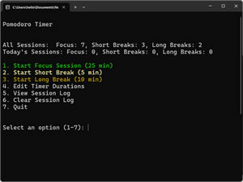
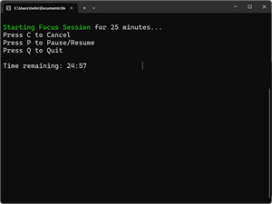
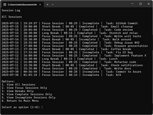

# PathCraft

**PathCraft** is a next-generation, path-focused workflow system built for creators, learners, and ambitious thinkers. It combines an adaptable, infinitely-nestable kanban board with integrated pomodoro tracking — empowering users to build and follow personalised paths through complex goals and creative projects.

---

## 🌟 Project Overview

PathCraft is the culmination of a structured, full-stack .NET development journey and a unique approach to productivity software.

Unlike traditional task or project managers, PathCraft’s core innovation lies in its dynamic kanban columns, where each column represents child items of the selected item in the column to its left. This allows unlimited layers of hierarchy customised to any workflow, avoiding rigid, fixed abstractions like “project”, “milestone”, or “task”.

Users create and save “paths”—ordered sequences of tasks or items—then select a path to focus on. Pomodoro session tracking is fully integrated to support focused work cycles tied directly to these paths, helping drive productivity and progress toward meaningful outcomes.

The system offers flexible templates and wizards tailored for common goals—building a website, writing a book, learning .NET, creating a social media channel, and more—that dynamically configure the board to fit the user’s unique needs.

At its core, PathCraft employs a unified data model where all items and columns reside in a single table linked via parent-child relationships, enabling unmatched adaptability and scalability.

---

## 🛄️ Learning Journey & Development Syllabus

PathCraft represents the final, fully-realised phase of a deliberate learning syllabus crafted to master modern .NET development from the ground up:

1. **Pomodoro Terminal App:**  
   Starting with a simple console-based pomodoro timer, foundational programming concepts were learned and demonstrated. Links: Webapp, Wiki, Branch. 

2. **Core Engine Refactoring:**  
   Business logic was extracted into a reusable, platform-agnostic core library, promoting clean architecture and testability.

3. **Windows Desktop Applications:**  
   The core logic was applied to **WinForms** and **WinUI 3** frontends, showcasing modern UI/UX principles and platform versatility.

4. **PathCraft Planning & Prototyping:**  
   The innovative workflow and interface were designed and validated through HTML/CSS/JavaScript prototypes, with a strong focus on Test-Driven Development (TDD).

5. **Full-Stack .NET Implementation:**  
   PathCraft was developed as a scalable, maintainable web application using **ASP.NET Core** and **Blazor**, integrating all prior learning into a cohesive, commercial-grade product.

---

## 🛠️ Technology Stack

- Backend: ASP.NET Core  
- Frontend: Blazor with HTML/CSS/JavaScript prototypes  
- Data: Relational model with parent-child linked data table  
- Testing: Comprehensive TDD with xUnit / NUnit for backend, Jest (or equivalent) for frontend

---

## 🤝 Contribution & Collaboration

This repository reflects a polished, production-ready codebase showcasing best practices in software design, architecture, and testing. While primarily developed solo as a learning project and portfolio piece, contributions and collaboration opportunities are welcome under the MIT License.

---

## 📄 License

This project is licensed under the MIT License. See [LICENSE](LICENSE) for full details.

---

## 📬 Contact

For questions, feedback, or professional inquiries, please feel free to reach out.

---

*Thank you for reviewing PathCraft.*